# 游戏项目 README

## 项目概述

这是一个基于Java的回合制棋盘游戏，支持2人或4人模式，具有多种游戏规则变体和高级功能。游戏采用面向对象设计,具有良好的可扩展性和可维护性。
## 变体规则
变体规则1（精确终点到达）：玩家必须准确地落在终点位置才能获胜。如果投掷的数字过高，玩家将先到达终点然后退回，沿着尾部往回走，剩余步数将逆时针绕着棋盘走完。

变体规则2（捕获规则）：如果一名玩家的棋子落在另一名玩家占据的位置上，那么被击中的玩家将被送回其家的位置。

变体规则3（单个骰子）：玩家每回合只投掷一个六面骰子。

变体规则4（大型棋盘）：游戏在一个更大的棋盘上进行，主要区域有36个位置（基本游戏为18个位置），尾部有6个位置（基本游戏为3个位置）。红色基地位置是1，蓝色基地位置是19（在四人模式中，家的位置分别为1、5、10、14；在大型棋盘四人模式中，家的位置分别为1、10、19、28）。
### 游戏流程
游戏启动时会提示选择游戏模式（两人或四人）和规则模式（普通规则或变体规则组合）。此外，还可以选择是否进入测试模式（使用预定义的骰子序列）。

1.选择游戏模式（2人或4人）

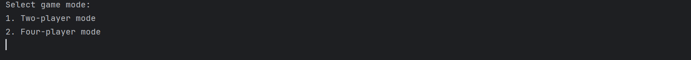
2.*游戏启动时的规则模式选择界面(普通和变体规则以及自由选择多种变体规则同时运用)*
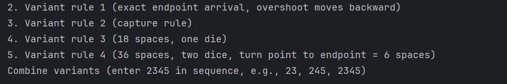

3*游戏启动时的选择测试模式(即用户可以自定义骰子的序列)*  

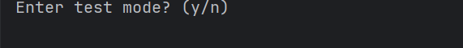  
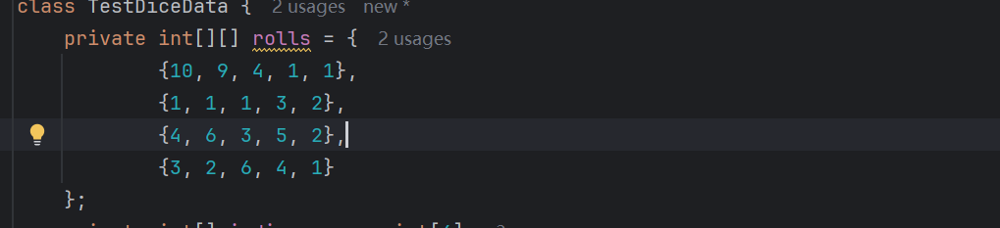 

4.*主要功能的演示*

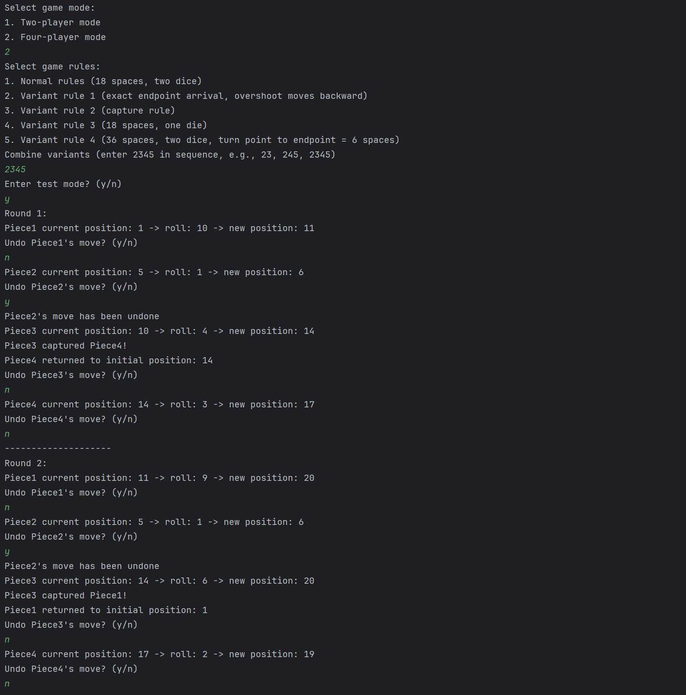有问题

5.*游戏结束的演示*  

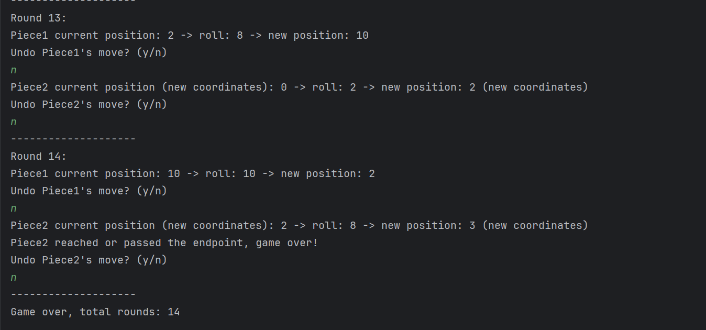

## 项目结构图
src/  
├── Game.java // 主程序入口  
├── GameController.java // 游戏流程控制  
├── GameConfig.java // 配置管理  
├── GameBoard.java // 棋盘管理  
├── GamePiece.java // 棋子实体  
├── MoveExecutor.java // 移动逻辑  
├── DiceRoller.java // 骰子系统  
├── UserInterface.java // 用户界面

## 控制类架构类图
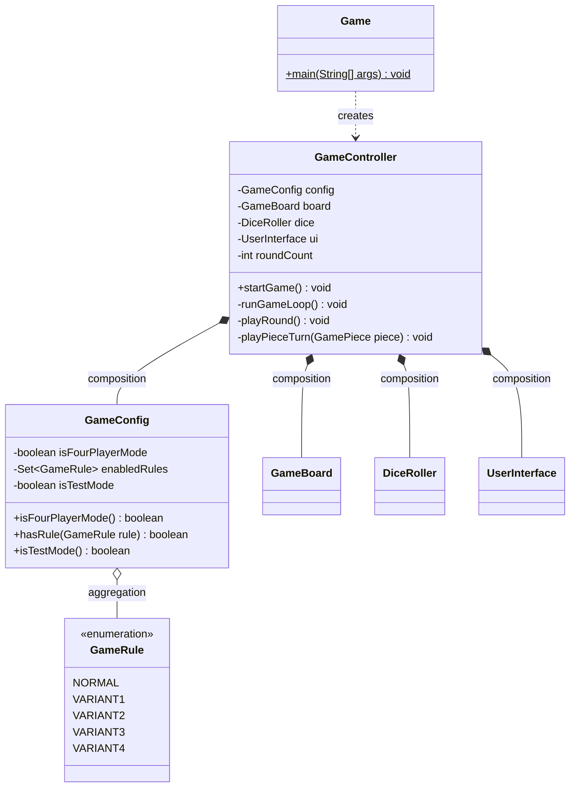
## 棋子类和地图类类图
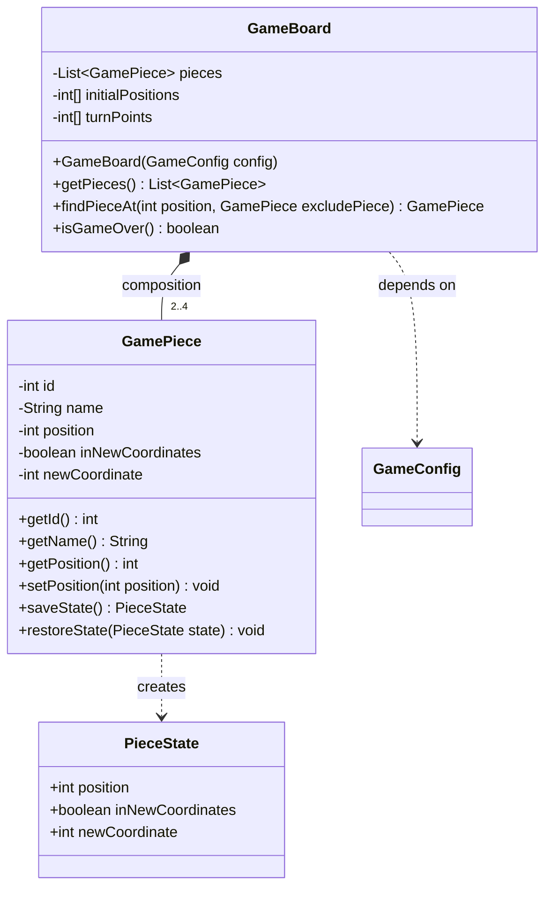
# 逻辑执行类图
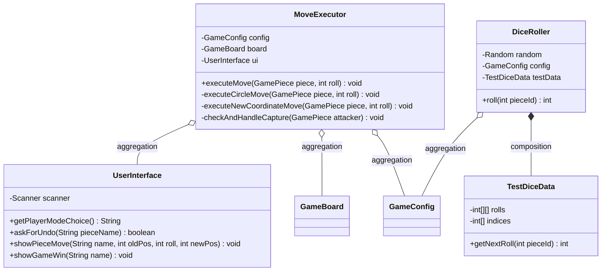

## 具体规则
普通规则:游戏地图分为两部分，圆盘部分18格  
*游戏地图(普通模式)*

变体规则1:与普通规则相比，在红框范围下,玩家必须准确地落在终点位置才能到达终点，如果投掷的数字过高，就先到达终点然后退回，沿着尾部往回走，并且还有剩余步数逆时针绕着棋盘走完剩下步数。  
*游戏地图(变体规则1)*

变体规则2:与普通规则相比，当玩家被HIT时(即后面的玩家落在前一位玩家占据的位置，前一位玩家会被HIT)，将被送回基地。如果发生击中事件，被击中的玩家将被送回其基地位置。  
变体规则3:与普通规则相比,每位玩家只能投掷一个六面骰子的步数来进行前进。  
变体规则4:与普通规则相比，地图会变大，圆盘上面的格子数会由18格增加到36格,红框里面的格子由3格增加到6格。  
为了增加游戏可玩性，玩家可以同时选择多种变体规则

## 高级功能
### 高级功能1:
四名玩家。该模拟使用四名玩家而非两名。对于基本地图，家的位置分别是 1、5、10 和 14。对于大地图，家的位置分别是 1、10、19 和 28。实施了这一变化后，该模拟可以由玩家选择两人模式或者四人模式。  

### 实现方法:
使用GameConfig类进行游戏规则管理  
根据玩家数目动态初始化玩家的初始位置和转向点  
使用基础功能相同的游戏循环逻辑来处理2名玩家和4名玩家的逻辑

### 核心组件:
GameConfig.isFourPlayerMode - 模式选择标志
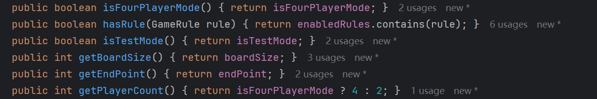
GameBoard.initialPositions - 动态初始位置数组  
GameBoard.turnPoints - 动态转向点数组
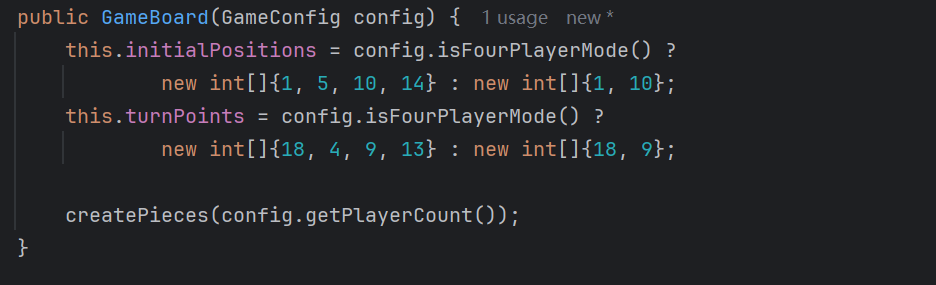
GameController.playRound() - 多玩家回合循环
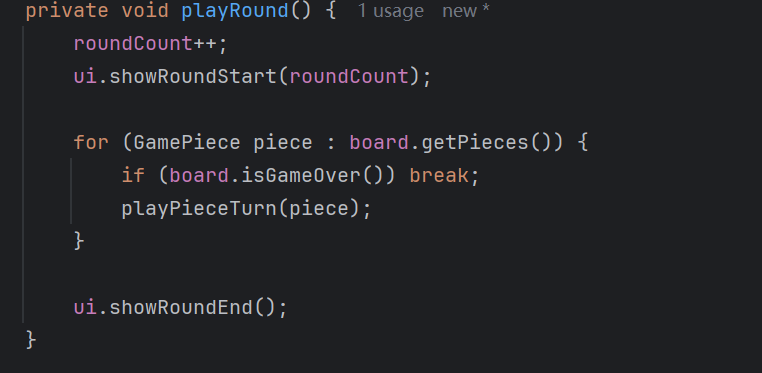

### 高级功能2:
撤销功能。添加了一个“撤销”功能，允许玩家在回合内撤销自己的操作。玩家可以在掷骰子后撤销当前棋子的移动，并重新尝试回合。

### 实现方法:

使用GameController类来管理撤销操作
通过GamePiece类保存每一步的棋子状态，以便回滚到之前的位置
引入PieceState类来存储棋子的状态数据，包括位置和新坐标

### 核心组件:

GameController.playRound() - 在每回合结束后，检查玩家是否需要撤销并进行相应的状态回滚

GamePiece.saveState() - 保存棋子的当前状态
GamePiece.restoreState() - 恢复棋子的先前状态
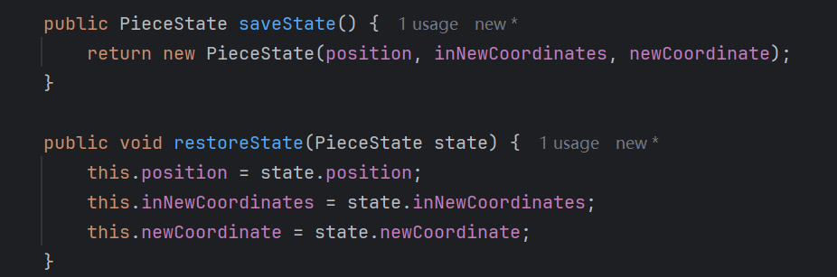
UserInterface.askForUndo() - 提示玩家是否执行撤销操作
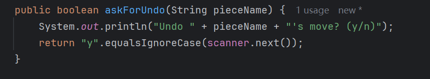

## AI Reference

### 将代码的输出从中文转成英文
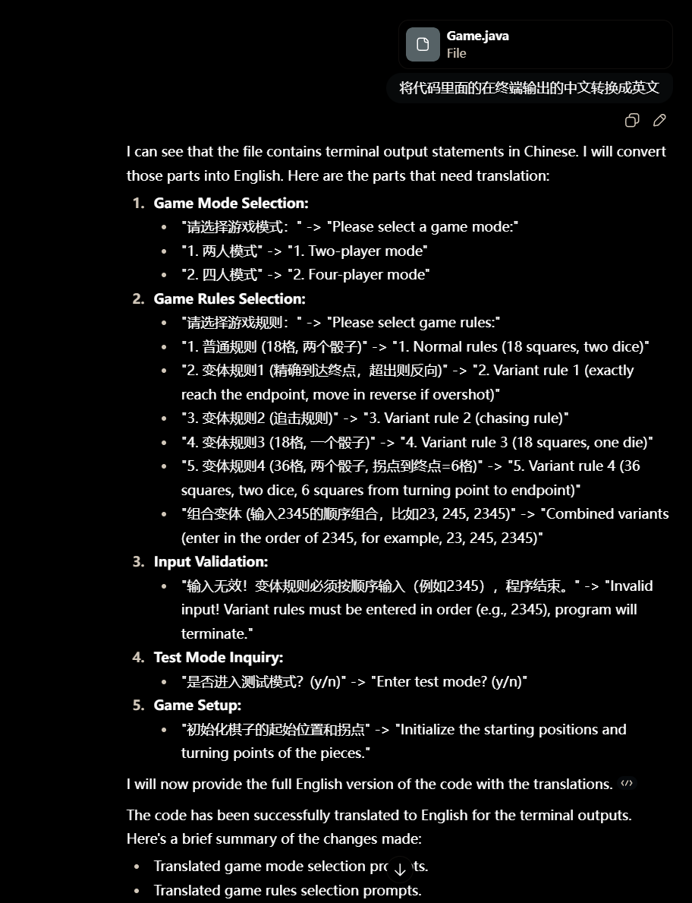
### 利用AI生成分别测试不同功能的固定序列
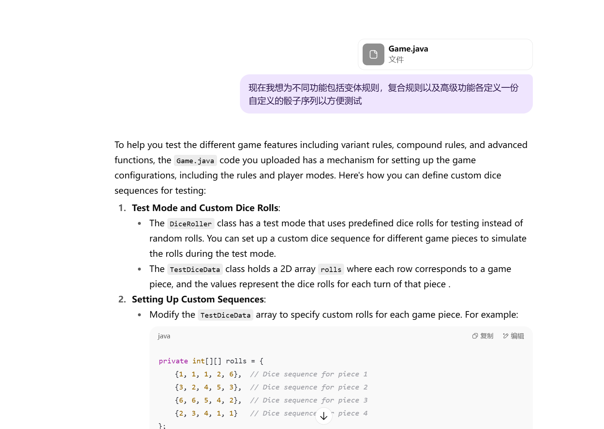