# Game Project README
李泰福 202331123002005  
TAIFU LI 21906048
## Project Overview

This is a Java-based turn-based board game that supports 2-player or 4-player modes, featuring multiple rule variants and advanced features. 
The game uses object-oriented design with good scalability and maintainability.

## Variant Rules

Variant Rule 1 (Exact Finish Requirement):  
Players must land exactly on the final position to win. If the rolled number is too high, the player will reach the end and then move backward along the tail, completing the remaining steps counterclockwise around the board.

Variant Rule 2 (Capture Rule):  
If a player’s piece lands on a position occupied by another player, the captured player is sent back to their home position.

Variant Rule 3 (Single Dice):  
Players roll only one six-sided die each turn.

Variant Rule 4 (Large Board):  
The game is played on a larger board — the main area has 36 positions (the base game has 18), and the tail has 6 positions (the base game has 3).
The red home position is 1, and the blue home position is 19 (in 4-player mode, the home positions are 1, 5, 10, and 14; in large-board 4-player mode, they are 1, 10, 19, and 28).
### Game process
At the start, players choose the game mode (2-player or 4-player) and rule mode (normal or combined variant rules). They can also select test mode 
(using predefined dice sequences).  
1.*Choose game mode (2 players or 4 players)*

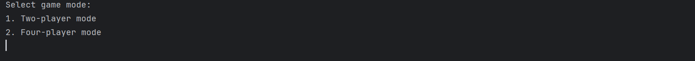
2.*Rule mode selection interface at startup (normal rules, variant rules, or custom combinations)*
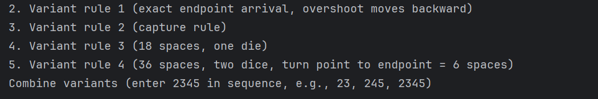

3*Select test mode (user can define dice sequences)*  

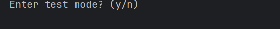  
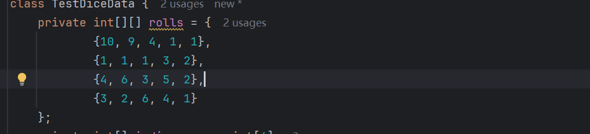 

4.*Demonstration of main functions*

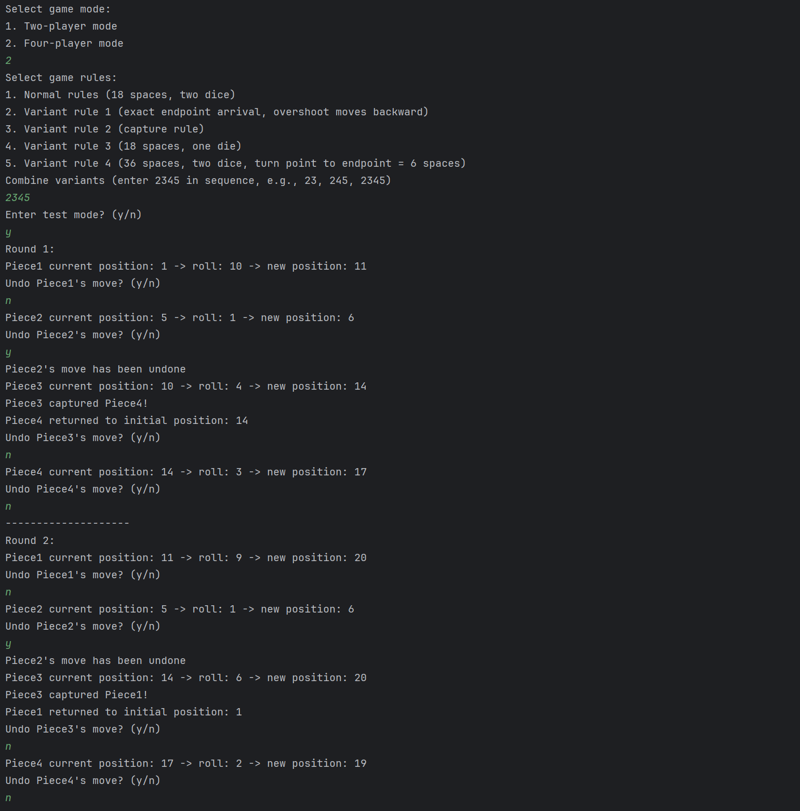

5.*Game over demonstration*  

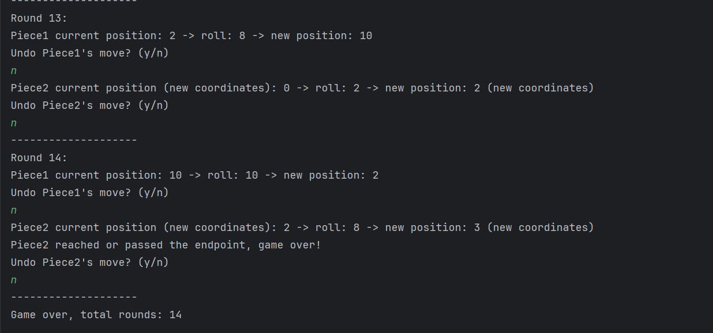

## Project structure diagram
src/  
├── Game.java // Main entry point  
├── GameController.java // Game flow control  
├── GameConfig.java // Configuration management  
├── GameBoard.java // Board management  
├── GamePiece.java // Game piece entity  
├── MoveExecutor.java // Movement logic  
├── DiceRoller.java // Dice system  
├── UserInterface.java // User interface

## Design mode
### MVC Architecture Pattern
Model Layer:  
Includes classes such as GameBoard, GamePiece, PieceState, etc., which are responsible for game logic and game logic flow.  

View Layer:  
The UserInterface class is responsible for interacting with the user, such as accepting input and outputting the current game state.  

Controller Layer:  
The GameController class is the controller, driving the game process, determining when to start the game, as well as player turns and state rollback, etc.
### UML
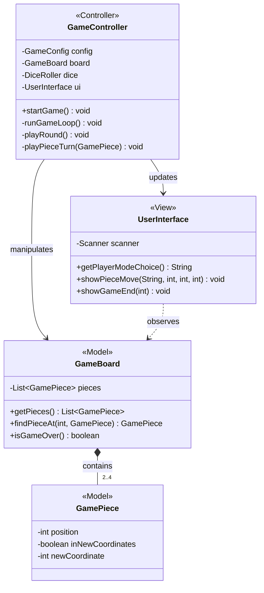
```mermaid
classDiagram
    class GameController {
        <<Controller>>
        -GameConfig config
        -GameBoard board
        -DiceRoller dice
        -UserInterface ui
        +startGame() void
        -runGameLoop() void
        -playRound() void
        -playPieceTurn(GamePiece) void
    }
    
    class GameBoard {
        <<Model>>
        -List~GamePiece~ pieces
        +getPieces() List~GamePiece~
        +findPieceAt(int, GamePiece) GamePiece
        +isGameOver() boolean
    }
    
    class GamePiece {
        <<Model>>
        -int position
        -boolean inNewCoordinates
        -int newCoordinate
    }
    
    class UserInterface {
        <<View>>
        -Scanner scanner
        +getPlayerModeChoice() String
        +showPieceMove(String, int, int, int) void
        +showGameEnd(int) void
    }

    GameController --> GameBoard : manipulates
    GameController --> UserInterface : updates
    UserInterface ..> GameBoard : observes
    GameBoard *-- "2..4" GamePiece : contains

```
#### Significance:
It can make the program structure clear, highly extensible, separate interface logic and game logic, and be easier to maintain.  

### Simple Factory Pattern:
Implementation Class:  PieceFactory Class  
This class centrally manages the creation logic of the pieces. All pieces are generated based on the PieceFactory class.  

### UML
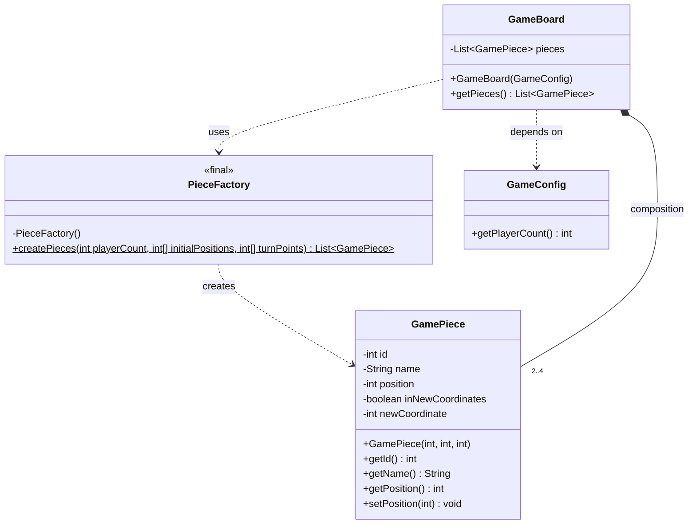
```mermaid
classDiagram
    class PieceFactory {
        <<final>>
        -PieceFactory() 
        +createPieces(int playerCount, int[] initialPositions, int[] turnPoints)$ List~GamePiece~
    }
    
    class GamePiece {
        -int id
        -String name
        -int position
        -boolean inNewCoordinates
        -int newCoordinate
        +GamePiece(int, int, int)
        +getId() int
        +getName() String
        +getPosition() int
        +setPosition(int) void
    }
    
    class GameBoard {
        -List~GamePiece~ pieces
        +GameBoard(GameConfig)
        +getPieces() List~GamePiece~
    }
    
    class GameConfig {
        +getPlayerCount() int
    }

    PieceFactory ..> GamePiece : creates
    GameBoard ..> PieceFactory : uses
    GameBoard ..> GameConfig : depends on
    GameBoard *-- "2..4" GamePiece : composition
```
#### Significance:
Separates object creation from object usage, eliminates repetitive code, facilitates expansion, and in the future, when adding new pieces, only the factory class needs to be modified without changing the main process logic.

### Memo mode
Originator: GamePiece  
Memento: PieceState  
Caretaker: GameController  
Before each move, save the state (saveState()), and if it is an undo operation, restore the state (restoreState()).
### UML
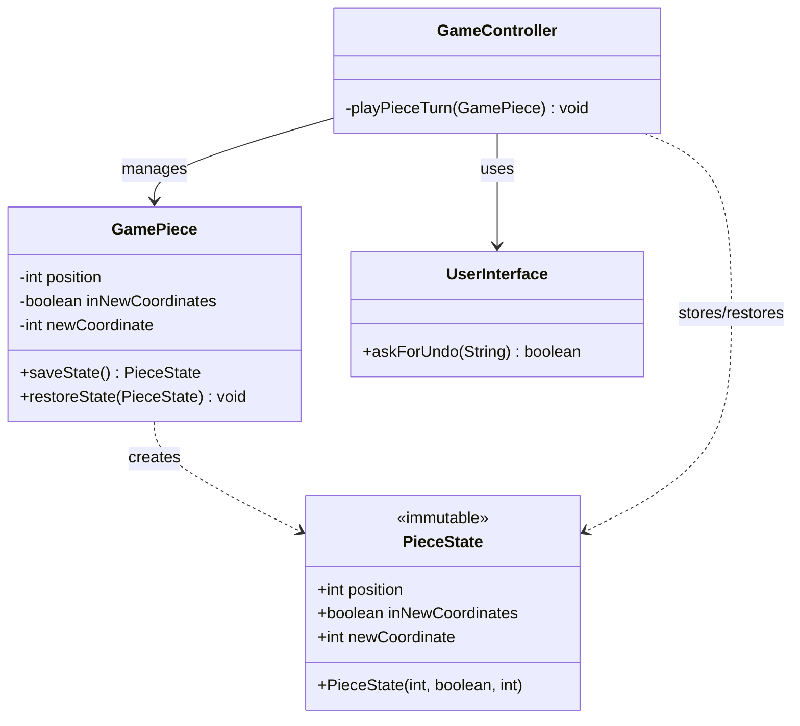
```mermaid
classDiagram
    class GamePiece {
        -int position
        -boolean inNewCoordinates
        -int newCoordinate
        +saveState() PieceState
        +restoreState(PieceState) void
    }
    
    class PieceState {
        <<immutable>>
        +int position
        +boolean inNewCoordinates
        +int newCoordinate
        +PieceState(int, boolean, int)
    }
    
    class GameController {
        -playPieceTurn(GamePiece) void
    }
    
    class UserInterface {
        +askForUndo(String) boolean
    }

    GamePiece ..> PieceState : creates
    GameController --> GamePiece : manages
    GameController --> UserInterface : uses
    GameController ..> PieceState : stores/restores
```
#### Significance:
Realize the "undo one step" function without compromising the encapsulation of the code.

### Strategy Pattern
Utilize the GameRule enumeration and conditional judgments to switch the corresponding game rules and logic algorithms
### UML
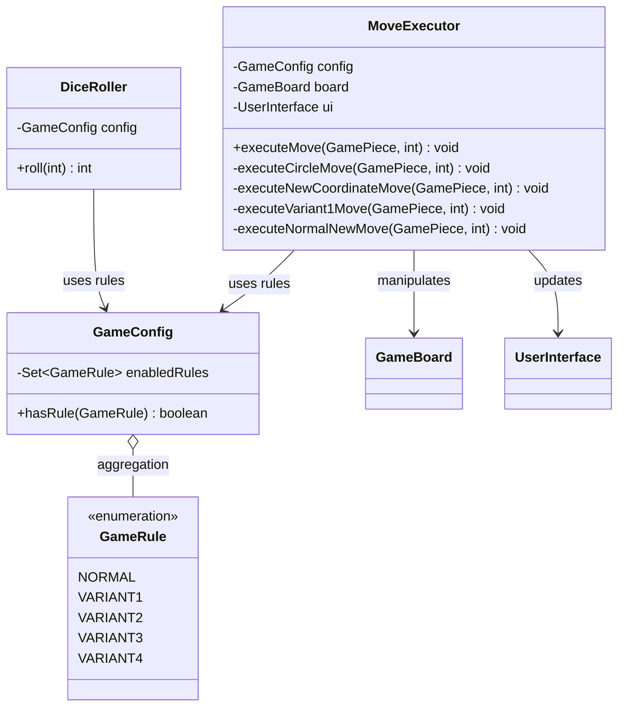
```mermaid
classDiagram
    class GameRule {
        <<enumeration>>
        NORMAL
        VARIANT1
        VARIANT2
        VARIANT3
        VARIANT4
    }
    
    class GameConfig {
        -Set~GameRule~ enabledRules
        +hasRule(GameRule) boolean
    }
    
    class MoveExecutor {
        -GameConfig config
        -GameBoard board
        -UserInterface ui
        +executeMove(GamePiece, int) void
        -executeCircleMove(GamePiece, int) void
        -executeNewCoordinateMove(GamePiece, int) void
        -executeVariant1Move(GamePiece, int) void
        -executeNormalNewMove(GamePiece, int) void
    }
    
    class DiceRoller {
        -GameConfig config
        +roll(int) int
    }

    GameConfig o-- GameRule : aggregation
    MoveExecutor --> GameConfig : uses rules
    DiceRoller --> GameConfig : uses rules
    MoveExecutor --> GameBoard : manipulates
    MoveExecutor --> UserInterface : updates
```
#### Significance:
Reduce the coupling of the code, making it easier to expand in the future, and conforming to the Open-Closed Principle

## Control class architecture diagram
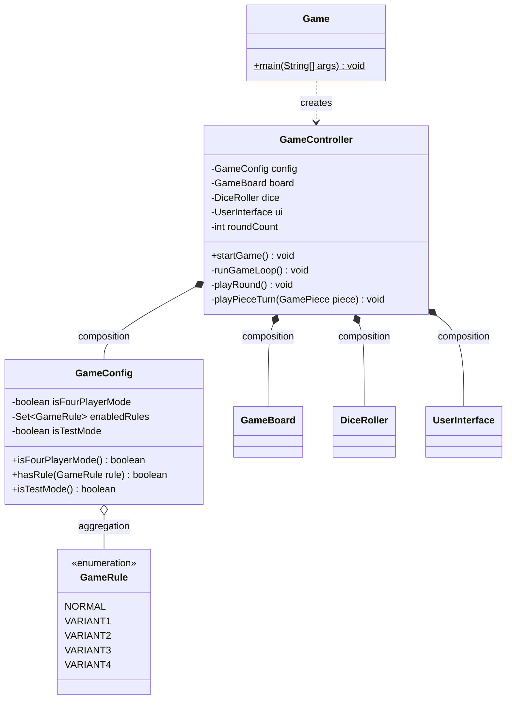
```mermaid
classDiagram
    class Game {
        +main(String[] args)$ void
    }
    
    class GameController {
        -GameConfig config
        -GameBoard board
        -DiceRoller dice
        -UserInterface ui
        -int roundCount
        +startGame() void
        -runGameLoop() void
        -playRound() void
        -playPieceTurn(GamePiece piece) void
    }
    
    class GameConfig {
        -boolean isFourPlayerMode
        -Set~GameRule~ enabledRules
        -boolean isTestMode
        +isFourPlayerMode() boolean
        +hasRule(GameRule rule) boolean
        +isTestMode() boolean
    }
    
    class GameRule {
        <<enumeration>>
        NORMAL
        VARIANT1
        VARIANT2
        VARIANT3
        VARIANT4
    }
    
    Game ..> GameController : creates
    GameController *-- GameConfig : composition
    GameController *-- GameBoard : composition
    GameController *-- DiceRoller : composition
    GameController *-- UserInterface : composition
    GameConfig o-- GameRule : aggregation
```
## Piece class and map class class diagram
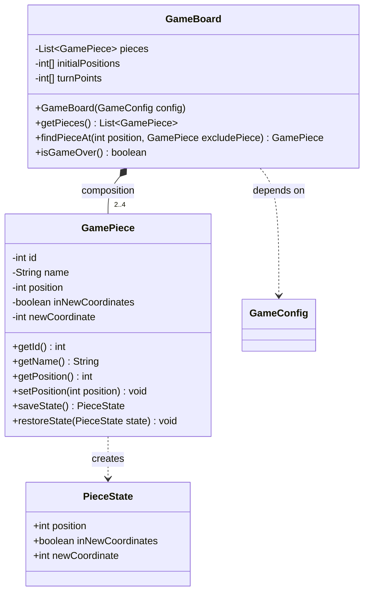
```mermaid
classDiagram
    class GameBoard {
        -List~GamePiece~ pieces
        -int[] initialPositions
        -int[] turnPoints
        +GameBoard(GameConfig config)
        +getPieces() List~GamePiece~
        +findPieceAt(int position, GamePiece excludePiece) GamePiece
        +isGameOver() boolean
    }
    
    class GamePiece {
        -int id
        -String name
        -int position
        -boolean inNewCoordinates
        -int newCoordinate
        +getId() int
        +getName() String
        +getPosition() int
        +setPosition(int position) void
        +saveState() PieceState
        +restoreState(PieceState state) void
    }
    
    class PieceState {
        +int position
        +boolean inNewCoordinates
        +int newCoordinate
    }
    
    GameBoard *-- "2..4" GamePiece : composition
    GamePiece ..> PieceState : creates
    GameBoard ..> GameConfig : depends on
```
# Logical Execution Class Diagram
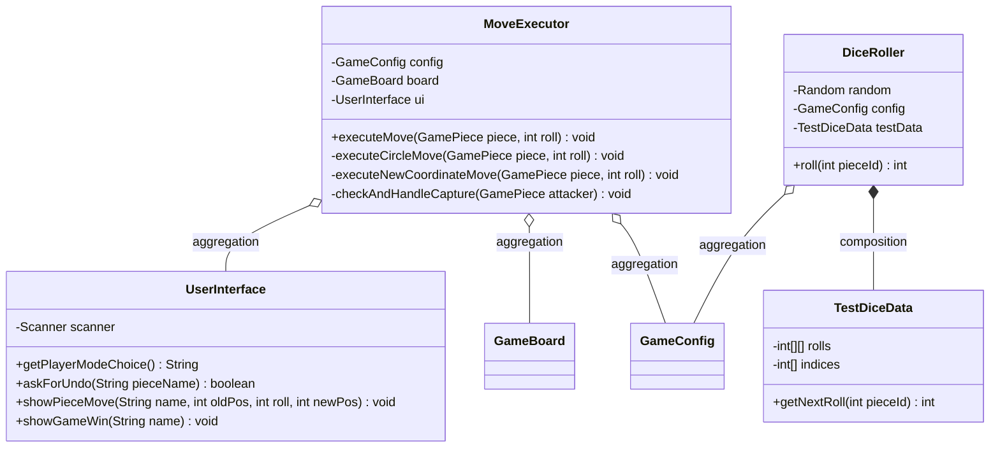
```mermaid
classDiagram
class MoveExecutor {
-GameConfig config
-GameBoard board
-UserInterface ui
+executeMove(GamePiece piece, int roll) void
-executeCircleMove(GamePiece piece, int roll) void
-executeNewCoordinateMove(GamePiece piece, int roll) void
-checkAndHandleCapture(GamePiece attacker) void
}

    class DiceRoller {
        -Random random
        -GameConfig config
        -TestDiceData testData
        +roll(int pieceId) int
    }
    
    class TestDiceData {
        -int[][] rolls
        -int[] indices
        +getNextRoll(int pieceId) int
    }
    
    class UserInterface {
        -Scanner scanner
        +getPlayerModeChoice() String
        +askForUndo(String pieceName) boolean
        +showPieceMove(String name, int oldPos, int roll, int newPos) void
        +showGameWin(String name) void
    }
    
    MoveExecutor o-- GameConfig : aggregation
    MoveExecutor o-- GameBoard : aggregation  
    MoveExecutor o-- UserInterface : aggregation
    DiceRoller o-- GameConfig : aggregation
    DiceRoller *-- TestDiceData : composition
```

## Specific rules
General rule: The game map is divided into two parts. The circular area consists of 18 squares, and the corner area has 3 squares.  
*Game map (Normal mode)*

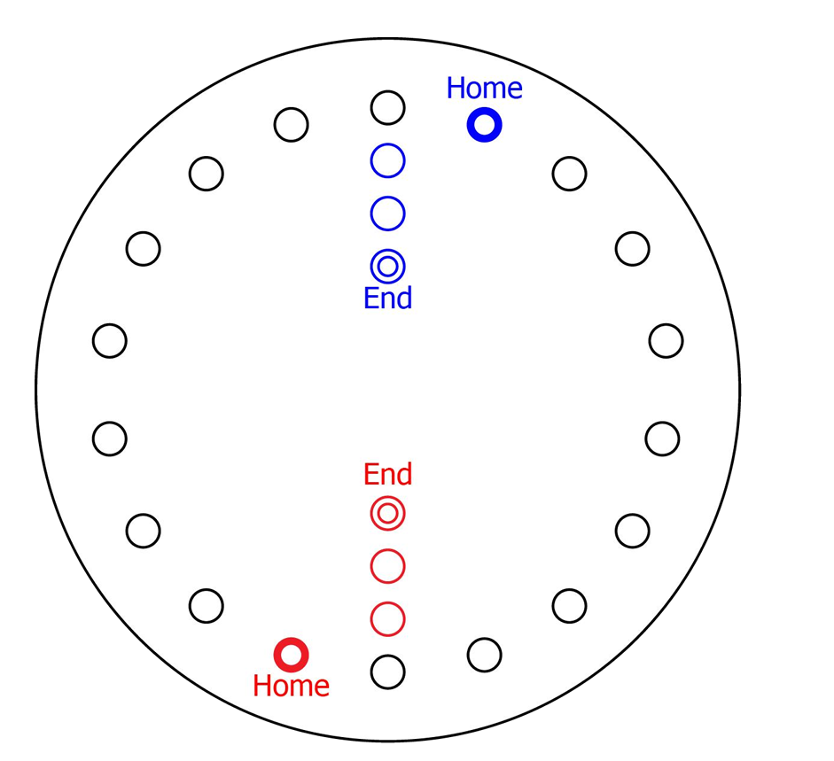
Variant Rule 1:
Compared to normal rules, within the red box area, players must land exactly on the finish position. If the dice roll is too high, the player first reaches the finish and then moves backward along the tail, continuing the remaining steps counterclockwise.  
*Game map (variant 1)*
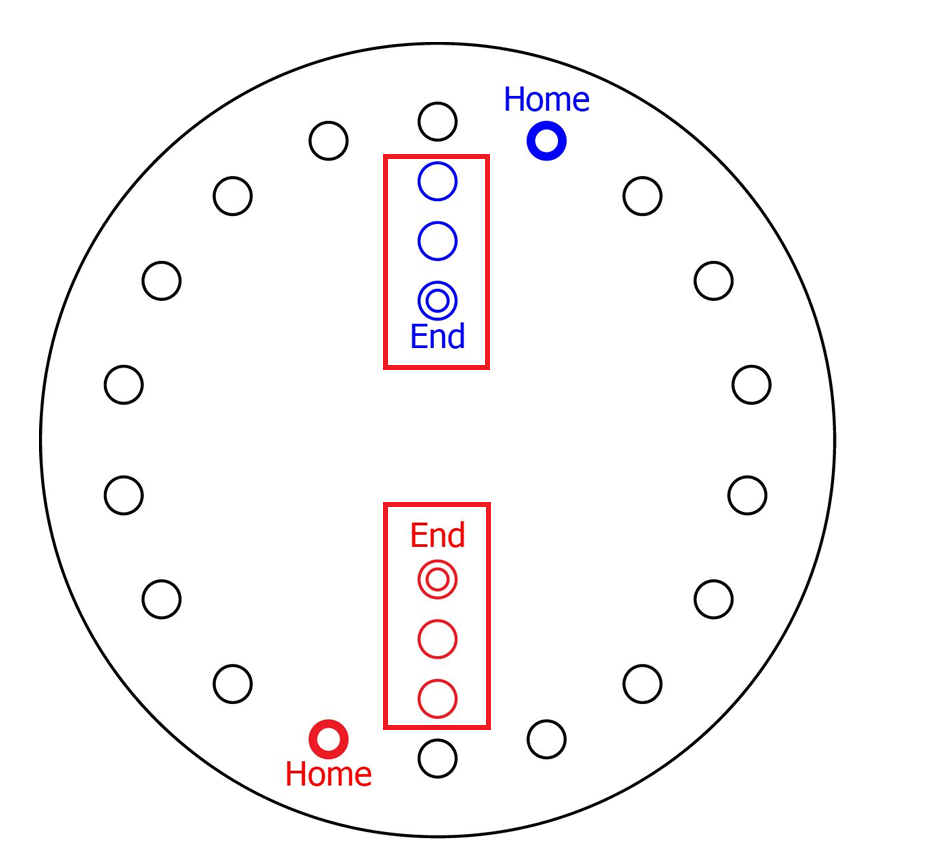
Variant Rule 2:  
When a player is HIT (i.e., another player lands on the same space), the hit player is sent back to their home base.  
Variant Rule 3:  
Players use only one six-sided die per turn.  
Variant Rule 4:  
The board expands, increasing the circular area from 18 to 36 spaces, and the tail from 3 to 6 spaces.
Players can combine multiple variant rules for more varied gameplay.

## Advanced Features
### Advanced Features 1:
Four-Player Mode – This simulation supports four players instead of two.
For the basic map, the home positions are 1, 5, 10, and 14.
For the large map, the home positions are 1, 10, 19, and 28.
This allows players to select between 2-player or 4-player modes.

### Implementation method:
Use GameConfig for rule management  
Dynamically initialize player start positions and turning points based on the player count  
Use the same game loop logic for both 2-player and 4-player modes

### Core component:
GameConfig.isFourPlayerMode - Mode selection flag
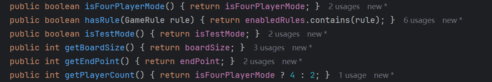

GameBoard.initialPositions - Dynamic initial position array  
GameBoard.turnPoints - Dynamic steering point array
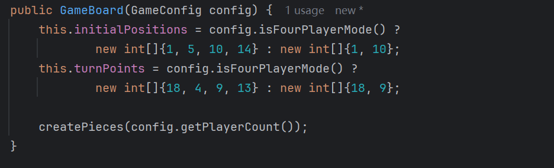

GameController.playRound() - Multi-player round loop
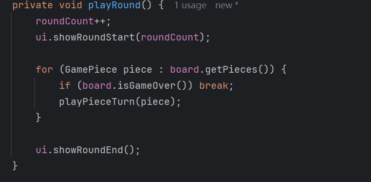

### Advanced Features 2:
Undo function. A "undo" function has been added, allowing players to reverse their actions within the round. 
Players can cancel the current movement of their piece after rolling the dice and retry the round.
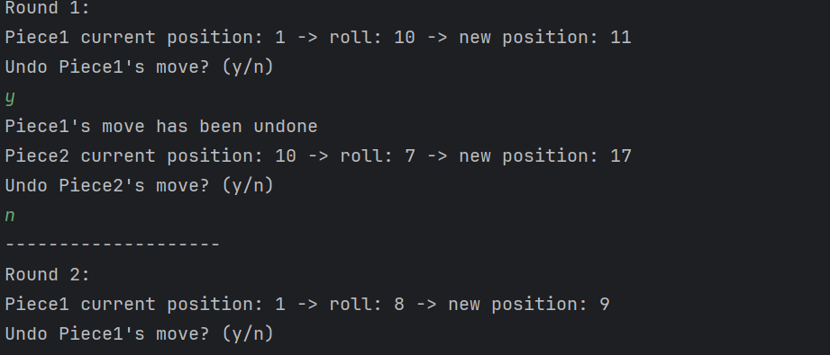
### Implementation method:

Manage undo actions through GameController  
Use GamePiece to store each move’s state for rollback  
Introduce PieceState to store piece state data (position and new coordinates)

### Core component:

GameController.playRound() - After each round is completed, check if the player needs to undo and perform the corresponding status rollback.

GamePiece.saveState() - Save the current state of the chess pieces
GamePiece.restoreState() - Restore the previous state of the chess pieces
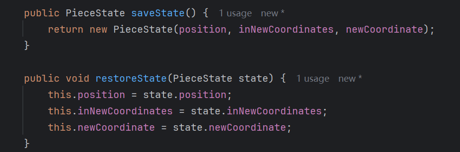

UserInterface.askForUndo() - Prompt the player whether to perform the undo operation
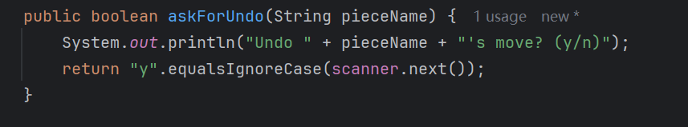

## AI Reference

### Convert the output of the code from Chinese to English.
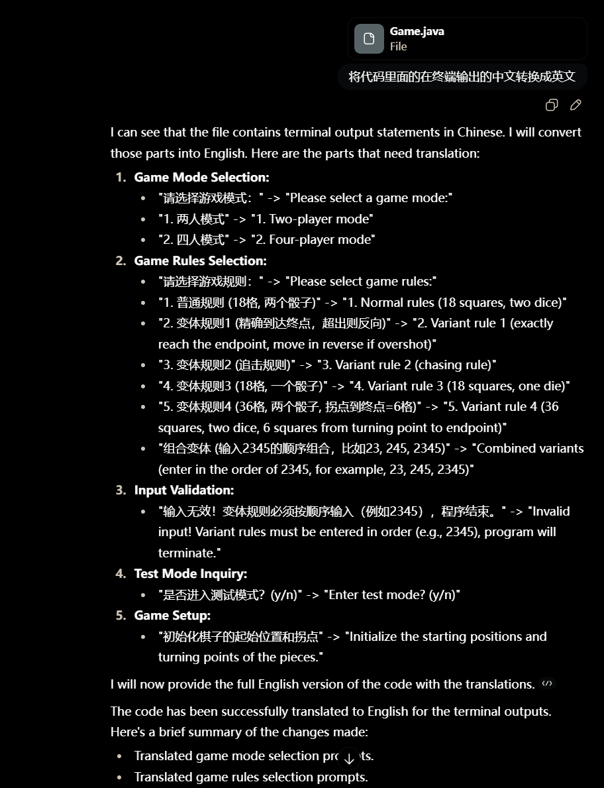
### Utilize AI to generate fixed sequences for testing different functions separately
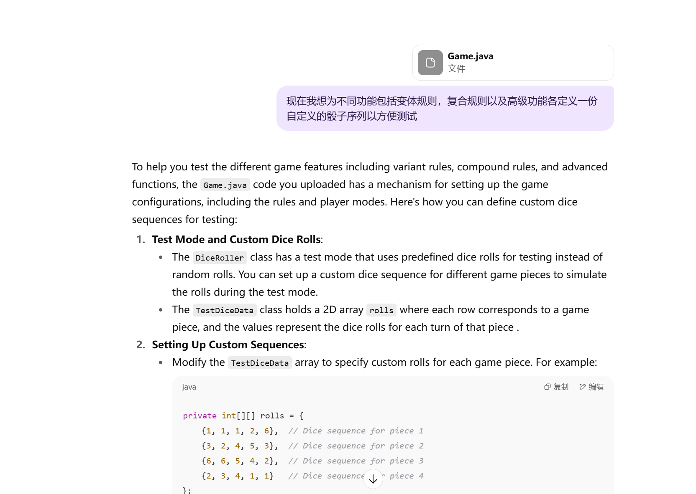
### Translate the "readme" file into English.
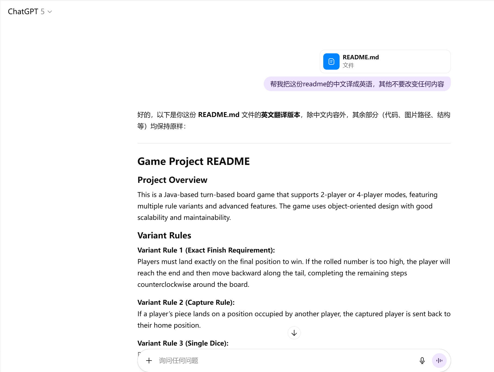